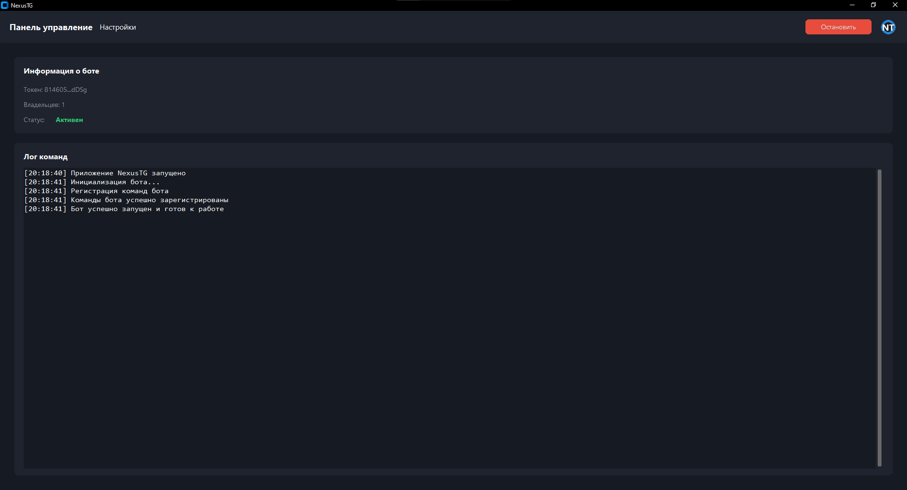
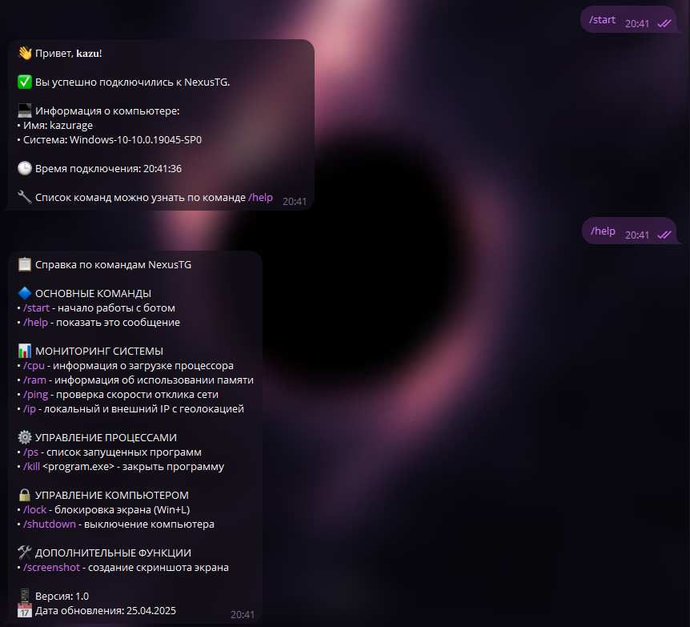

# 🚀 NexusTG

**NexusTG** — это настольная программа, которая позволяет управлять компьютером через Telegram-бота.  
Просто введите токен, настройте владельцев, и запускайте — всё управление в чате Telegram.

---

## 📁 Структура проекта

```bash
NexusTG/
├── main.py              # Точка входа программы
├── src/                 # Исходный код (модули, логика, функции)
│   ├── bot.py           # Логика Telegram бота
│   ├── commands.py      # Команды для управления ПК
│   └── config.py        # Работа с конфигурацией
├── cfg/
│   ├── config.json      # Конфигурация бота
│   └── content/         # Фотографии, аватары, данные
├── README.md            # Документация проекта
└── TODO.md              # План разработки
```

# Программа 



# Бот

